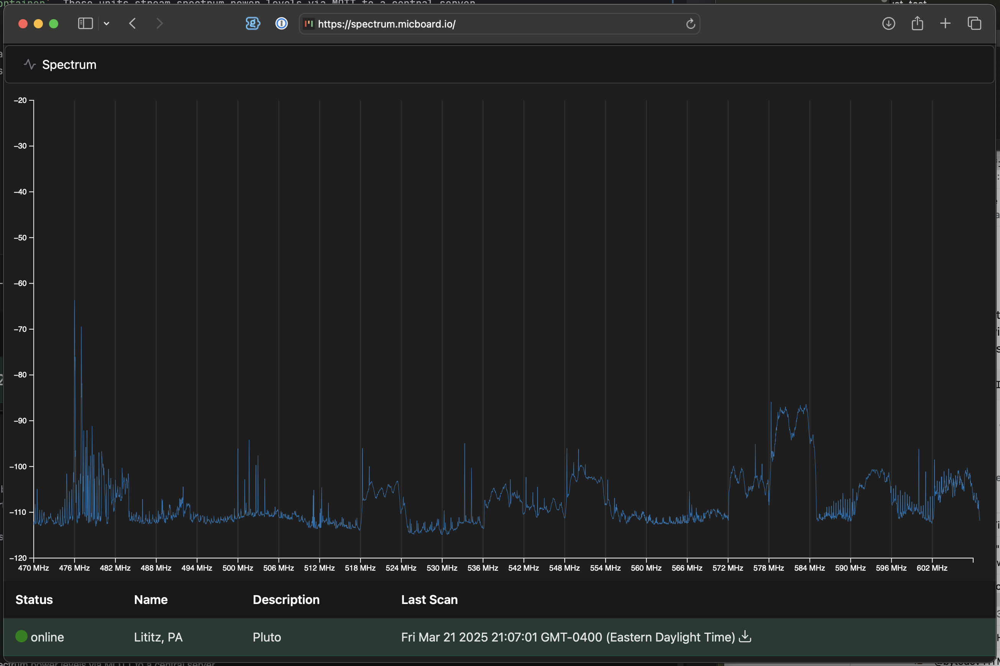

# spectrum-frontend
micboard spectrum is a prototype multi-site rf scanning system.

## Components
* [soapySDR-container](https://github.com/karlcswanson/soapySDR-container) - A container that provides the necessary libraries for soapy_power with support for ad9361 and rtlsdr based devices. 
* [spectrum-capture](https://github.com/karlcswanson/spectrum-capture) - A wrapper for [soapy_power](https://github.com/xmikos/soapy_power) and rtl_power. `spectrum-capture` runs a child process and streams the rtl_power formatted output to mqtt server. Incremental and complete scans are sent as different topics. This program is run within soapySDR-container.
* [spectrum-frontend](https://github.com/karlcswanson/spectrum-frontend) - Vue3 based frontend for micboard-spectrum. This displays streaming spectrum data from selected sites. Scan data can also be exported to csv.
* mqtt broker - Eclipse Mosquitto is used for development, nothing in micboard-spectrum requires it specifically.

## Architecture
### Distributed
For multi-site scanning, remote scan units run `spectrum-capture` within the `soapySDR-container`. These units stream spectrum power levels via MQTT to a central server.

On the central server:
- A web server (Caddy) hosts the `spectrum-frontend`. Live data from multiple scanners can be visualized.
- WebSocket connections (wss) are proxied to an MQTT broker (Eclipse Mosquitto), also hosted on the central server.

### Standalone
In a standalone configuration, all components — `spectrum-capture`, web server, and MQTT broker — run locally. This eliminates the need for a central server, ideal for scenarios where scan data is only needed locally.
